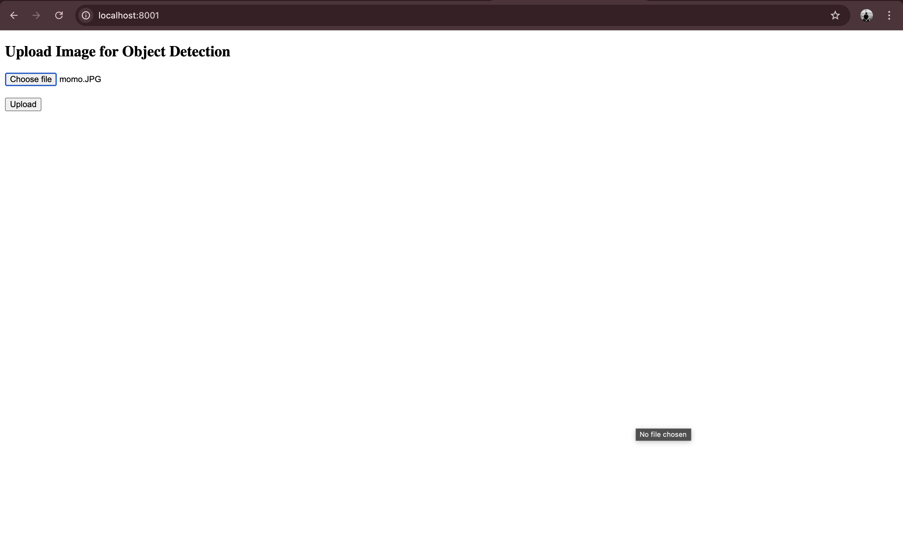

# ML Assignment - Object Detection using YOLO

## Overview
This project implements an **object detection system** using **YOLOv3** powered by FastAPI and Docker. The project provides:
1. **Backend API** for performing object detection.
2. **Frontend Interface** to upload images and view results.

The setup instructions include detailed steps to get the system running on **Mac**, **Windows**, and **Linux** systems.

---

## Table of Contents
1. [Prerequisites](#prerequisites)
2. [Docker Installation](#docker-installation)
    - Mac
    - Windows
    - Linux
3. [Project Setup](#project-setup)
4. [Running the Project](#running-the-project)
5. [Understanding the Code](#understanding-the-code)
6. [Log Checking and Debugging](#log-checking-and-debugging)
7. [Challenges and Fixes](#challenges-and-fixes)
8. [Screenshots](#screenshots)
9. [Final Notes](#final-notes)

---

## Prerequisites
To successfully run this project, ensure the following tools are installed on your system:
- **Docker**
- **Git**

### Recommended Specs
- **RAM**: 8 GB minimum
- **CPU**: Multi-core for faster Docker performance
- **OS**: MacOS, Windows 10/11, or Linux (Ubuntu recommended)

---

## Docker Installation

### For MacOS
1. Download **Docker Desktop for Mac**:
   - Visit [Docker for Mac](https://docs.docker.com/desktop/mac/install/).
   - Click **Download for Mac**.
2. Install Docker:
   - Open the downloaded `.dmg` file.
   - Drag **Docker** into the Applications folder.
3. Start Docker:
   - Open Docker Desktop from **Applications**.
   - Verify installation:
     ```bash
     docker --version
     docker-compose --version
     ```

### For Windows
1. Download **Docker Desktop for Windows**:
   - Visit [Docker for Windows](https://docs.docker.com/desktop/windows/install/).
   - Download and install Docker Desktop.
2. Enable WSL2 (required for Docker):
   - Follow the guide: [Enable WSL2](https://docs.microsoft.com/en-us/windows/wsl/install).
3. Verify installation:
   ```bash
   docker --version
   docker-compose --version
   ```

### For Linux (Ubuntu)
1. Update your system:
   ```bash
   sudo apt update && sudo apt upgrade
   ```
2. Install Docker:
   ```bash
   sudo apt install docker.io
   sudo systemctl start docker
   sudo systemctl enable docker
   ```
3. Install Docker Compose:
   ```bash
   sudo apt install docker-compose
   ```
4. Verify installation:
   ```bash
   docker --version
   docker-compose --version
   ```

---

## Project Setup
1. **Clone the Repository**:
   ```bash
   git clone https://github.com/Tamaghnatech/ML_Assignment_AIMonk.git
   cd ML_Assignment_AIMonk
   ```
2. **Directory Structure**:
   ```
   ML_Assignment_AIMonk/
   ├── ai_backend.py       # Backend logic for object detection
   ├── ui_backend.py       # Frontend logic to upload images
   ├── Dockerfile          # Dockerfile for backend
   ├── docker-compose.yml  # Compose file to orchestrate services
   └── ...                # Other necessary files
   ```
3. **Ensure Docker is Running**:
   ```bash
   docker --version
   ```
   If Docker is not running, start Docker Desktop.

---

## Running the Project

1. **Build the Docker Images**:
   ```bash
   docker-compose build
   ```

2. **Start the Services**:
   ```bash
   docker-compose up
   ```
   - This command will start both the **backend** and **frontend** services.
   - **Backend API** runs on: `http://localhost:8000`
   - **Frontend UI** runs on: `http://localhost:8001`

3. **Access the UI**:
   - Open a browser and go to:
     ```
     http://localhost:8001
     ```
   - Upload an image file for object detection.

4. **Monitor Logs**:
   - View real-time logs in your terminal:
     ```bash
     docker-compose logs -f
     ```

5. **Stop the Services**:
   ```bash
   docker-compose down
   ```

---

## Understanding the Code

### Backend (ai_backend.py)
- Loads the **YOLOv3 model** from Ultralytics.
- Processes uploaded images and performs object detection.
- Saves detection results as:
  - Annotated Image
  - JSON file with detected objects.

### Frontend (ui_backend.py)
- Provides an endpoint to upload images.
- Sends images to the backend for processing.
- Displays detection results.

### Dockerfile and docker-compose.yml
- Dockerfile defines how to package the **ai_backend**.
- `docker-compose.yml` orchestrates the backend and frontend containers.

---

## Log Checking and Debugging
1. To check Docker logs:
   ```bash
   docker-compose logs
   ```
2. To debug errors in the backend or frontend:
   - Check logs for error messages.
   - Use `docker ps` to verify containers are running.
3. Restart Containers:
   ```bash
   docker-compose down && docker-compose up --build
   ```

---

## Challenges and Fixes
During development, I faced the following challenges and resolved them as follows:

1. **"libGL.so.1: cannot open shared object file"**:
   - Solution: Installed necessary dependencies in the Dockerfile:
     ```Dockerfile
     RUN apt-get update && apt-get install -y libgl1-mesa-glx libglib2.0-0
     ```

2. **`python-multipart` Error**:
   - Solution: Added `python-multipart` to `pip install` in the Dockerfile.

3. **Failed to Push Code to GitHub**:
   - Issue: Local branch was behind the remote.
   - Solution: Used:
     ```bash
     git pull origin main --rebase
     git push -u origin main
     ```

4. **Internal Server Error 500**:
   - Checked logs using `docker-compose logs`.
   - Fixed incorrect attribute in YOLO result parsing.

---

## Screenshots
### Working Webpage


### Object Detection Results


> Replace `path-to-...` with the actual paths to your screenshots.

---

## Final Notes
- This project demonstrates a complete **end-to-end pipeline** for object detection.
- Logs, errors, and troubleshooting steps are included for smooth setup.

If you face any issues during setup, please feel free to reach out.

---

**Developed by:** Tamaghna Nag  
**Repository Link:** [ML_Assignment_AIMonk](https://github.com/Tamaghnatech/ML_Assignment_AIMonk)
